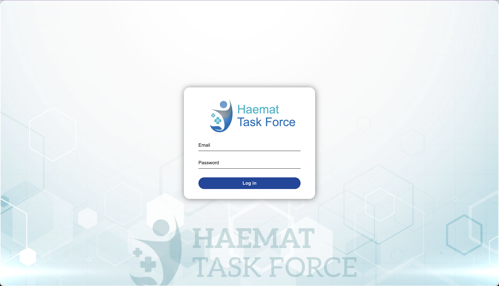
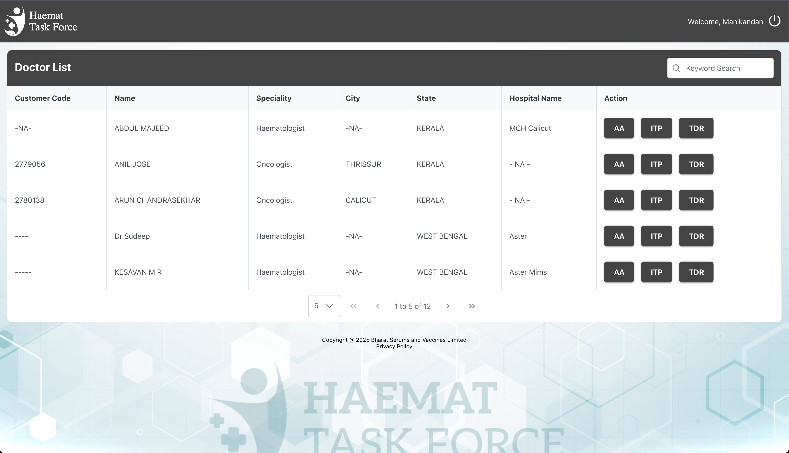
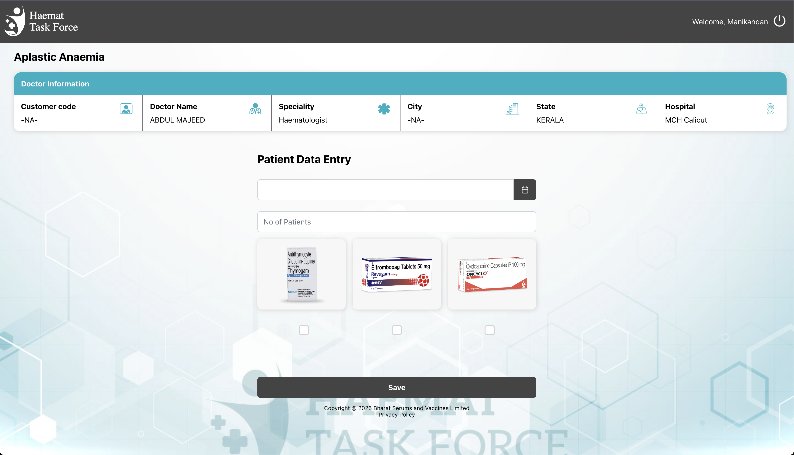
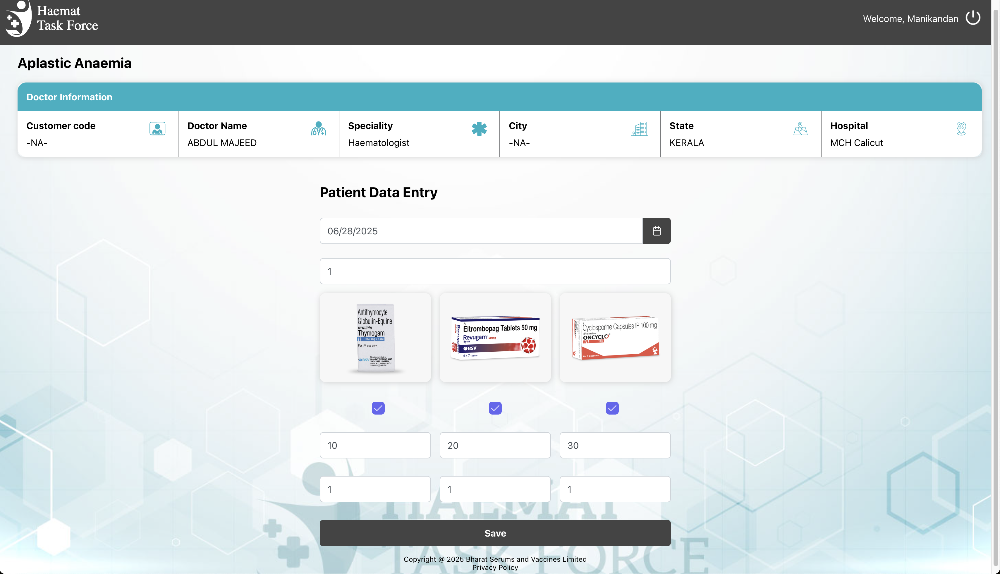
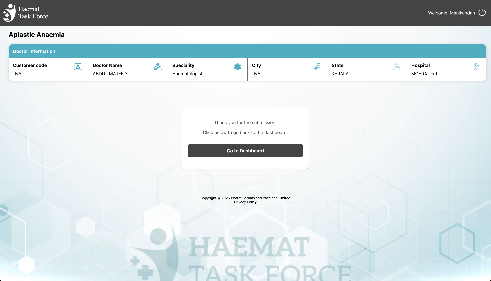

# Haemat Task Force - User Module

This is the **User Module** for the Haemat Task Force platform developed for Bharat Serums and Vaccines Limited. It is designed to assist healthcare professionals in managing and submitting patient data related to various hematological conditions through a streamlined and responsive interface.


## 🔍 Overview

The platform empowers doctors and healthcare staff to:
- View assigned doctors and their details.
- Select treatment modules (e.g., AA, ITP, TDR).
- Enter and submit patient treatment data efficiently.
- Monitor submissions through a dashboard interface.

---

## 🚀 Features

- 🔐 **Secure Login System**
- 🧑‍⚕️ **Doctor Listing with Speciality & Hospital Info**
- 📄 **Condition-Specific Treatment Modules (AA, ITP, TDR)**
- 💊 **Medicine & Quantity Selection**
- 📅 **Date & Patient Count Input**
- ✅ **Data Submission & Confirmation Screen**
- 🔍 **Search Functionality in Doctor Listing**
- 🧑‍💼 **Personalized Welcome UI for Logged-in Users**

---

## 🛠 Tech Stack

| Layer      | Technology                  |
|------------|------------------------------|
| Frontend   | **ReactJS**, HTML, CSS, SASS |
| UI Library | **PrimeReact**, Bootstrap    |

---

## 📸 Screenshots

### Login Interface


### Doctor List View


### Patient Data Entry - Aplastic Anaemia


### Medicine Selection and Quantity Input


### Submission Confirmation


> _Screenshots are for demonstration purposes. Sensitive information is anonymized._

---

## 📁 Project Setup

```bash
# Clone the repo
git clone https://github.com/ajayvishwakarma457/Haemat-User-Module.git
cd Haemat-User-Module

# Install dependencies
npm install

# Run the app
npm start

## 📬 Contact
**Author:** Ajay M Vishwakarma  
**Email:** ajayvishwakarma457@gmail.com
